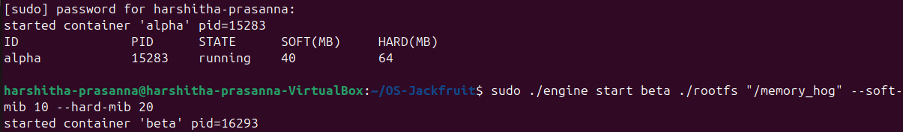
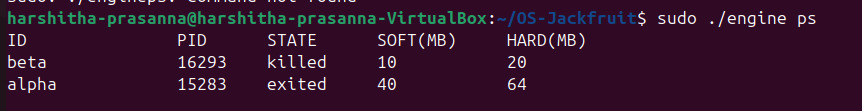
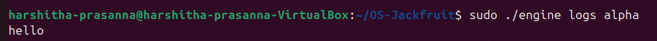
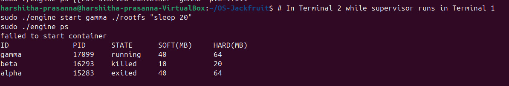
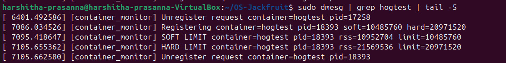
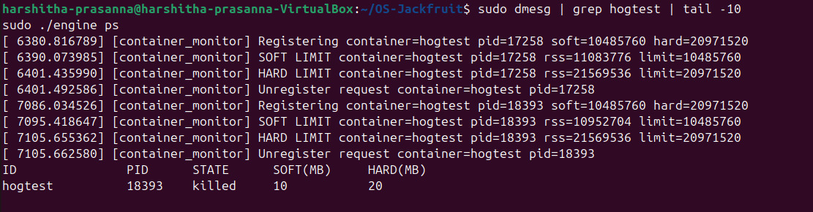
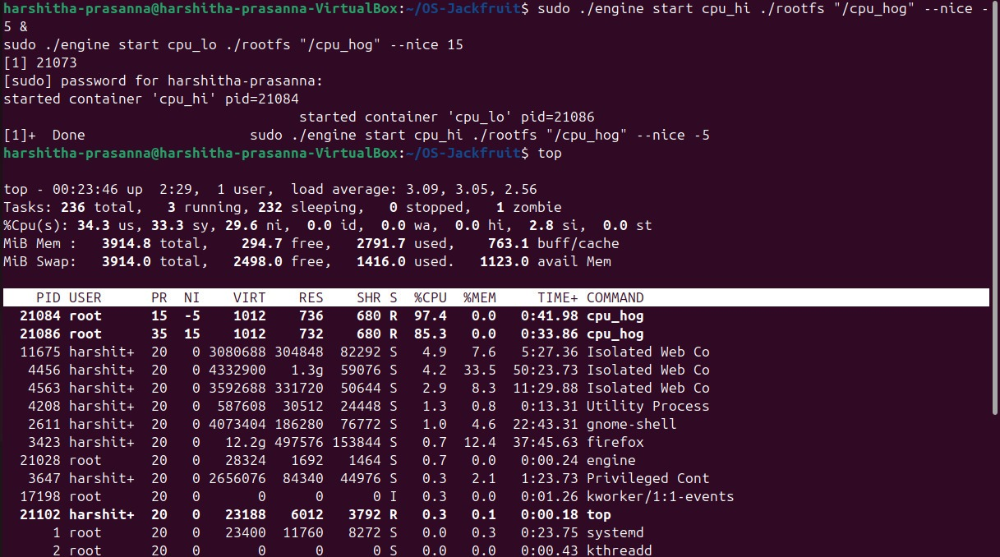
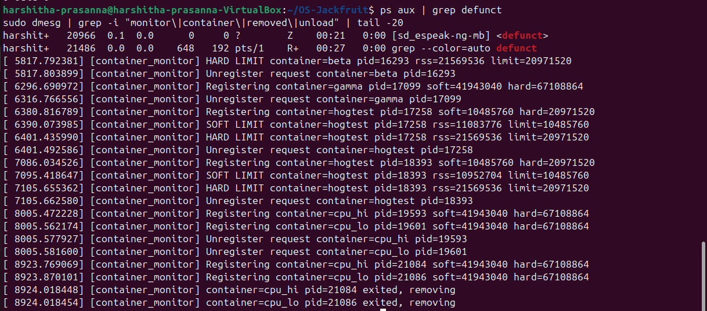

# Multi-Container Runtime

## 1. Team Information

- Team member 1: `Gagan` - `PES1UG24CS166`
- Team member 2: `Dhruva Myakeri` - `PES1UG24CS156`

Replace the placeholders above before submission.

## 2. Build, Load, and Run Instructions

### Environment

- Ubuntu 22.04 or 24.04 VM
- Secure Boot disabled
- Root access available
- Linux headers installed for the running kernel

### Install Dependencies

```bash
sudo apt update
sudo apt install -y build-essential linux-headers-$(uname -r) wget
```

### Prepare Root Filesystems

```bash
mkdir -p rootfs-base
wget https://dl-cdn.alpinelinux.org/alpine/v3.20/releases/x86_64/alpine-minirootfs-3.20.3-x86_64.tar.gz
tar -xzf alpine-minirootfs-3.20.3-x86_64.tar.gz -C rootfs-base

cp -a ./rootfs-base ./rootfs-alpha
cp -a ./rootfs-base ./rootfs-beta
cp -a ./rootfs-base ./rootfs-gamma
```

### Build

Top-level build:

```bash
make
```

CI-safe compile-only path:

```bash
make ci
make -C boilerplate ci
```

### Load the Kernel Module

```bash
sudo insmod monitor.ko
ls -l /dev/container_monitor
```

### Copy Workloads into Container RootFS

```bash
cp ./memory_hog ./rootfs-alpha/
cp ./cpu_hog ./rootfs-alpha/
cp ./io_pulse ./rootfs-alpha/

cp ./memory_hog ./rootfs-beta/
cp ./cpu_hog ./rootfs-beta/
cp ./io_pulse ./rootfs-beta/
```

### Start the Supervisor

```bash
sudo ./engine supervisor ./rootfs-base
```

The supervisor creates a control socket at `/tmp/mini_runtime.sock` and writes per-container logs under `./logs/`.

### CLI Usage

```bash
sudo ./engine start <id> <container-rootfs> <command> [--soft-mib N] [--hard-mib N] [--nice N]
sudo ./engine run   <id> <container-rootfs> <command> [--soft-mib N] [--hard-mib N] [--nice N]
sudo ./engine ps
sudo ./engine logs <id>
sudo ./engine stop <id>
```

Examples:

```bash
sudo ./engine start alpha ./rootfs-alpha "echo hello-from-alpha"
sudo ./engine start beta  ./rootfs-beta  "/cpu_hog 15" --nice 5
sudo ./engine ps
sudo ./engine logs alpha
sudo ./engine stop beta
```

Foreground execution:

```bash
sudo ./engine run gamma ./rootfs-gamma "/bin/sh -c 'echo run-mode && sleep 2'"
echo $?
```

### Memory-Monitor Demonstration

Start a container with low memory limits:

```bash
cp -a ./rootfs-base ./rootfs-mem
cp ./memory_hog ./rootfs-mem/
sudo ./engine start mem ./rootfs-mem "/memory_hog 8 500" --soft-mib 24 --hard-mib 40
```

Observe:

```bash
sudo ./engine ps
sudo ./engine logs mem
dmesg | tail -n 50
```

Expected behavior:

- first soft-limit crossing logs a warning in `dmesg`
- hard-limit crossing triggers `SIGKILL`
- `engine ps` shows `reason=hard_limit_killed`

### Scheduler Experiment Procedure

Experiment A: two CPU-bound containers with different `nice` values.

```bash
cp -a ./rootfs-base ./rootfs-cpu-a
cp -a ./rootfs-base ./rootfs-cpu-b
cp ./cpu_hog ./rootfs-cpu-a/
cp ./cpu_hog ./rootfs-cpu-b/

sudo ./engine start cpu_hi ./rootfs-cpu-a "/cpu_hog 20" --nice 0
sudo ./engine start cpu_lo ./rootfs-cpu-b "/cpu_hog 20" --nice 10
watch -n 1 sudo ./engine ps
```

Experiment B: CPU-bound and I/O-bound together.

```bash
cp -a ./rootfs-base ./rootfs-io
cp ./io_pulse ./rootfs-io/

sudo ./engine start io1 ./rootfs-io "/io_pulse 30 200" --nice 0
sudo ./engine start cpu2 ./rootfs-cpu-a "/cpu_hog 20" --nice 0
```

Collect:

- completion times
- log timestamps
- `ps` output snapshots
- `time` command output if you wrap `engine run`

### Stop and Clean Up

```bash
sudo ./engine stop alpha
sudo ./engine stop beta
sudo ./engine stop gamma

sudo pkill -TERM -f "engine supervisor" || true
dmesg | tail -n 50
sudo rmmod monitor
rm -f /tmp/mini_runtime.sock
```

If `/proc` remains mounted inside a copied rootfs after an abnormal stop, unmount it before deleting the directory:

```bash
sudo umount ./rootfs-alpha/proc 2>/dev/null || sudo umount -l ./rootfs-alpha/proc 2>/dev/null || true
```

## 3. Demo with Screenshots

### 1. Multi-container supervision

Shows two or more containers running under one supervisor process.



### 2. Metadata tracking

Shows `engine ps` output with tracked container metadata such as PID, state, limits, reason, and log path.



### 3. Bounded-buffer logging

Shows per-container log capture through the logging pipeline.



### 4. CLI and IPC

Shows a CLI command being issued and handled by the supervisor over the control-plane IPC path.



### 5. Soft-limit warning

Shows the kernel module warning when a container exceeds its soft memory limit.



### 6. Hard-limit enforcement

Shows the kernel module killing a container after it exceeds the hard memory limit, with supervisor metadata reflecting that outcome.



### 7. Scheduling experiment

Shows workload behavior under different scheduling conditions.



### 8. Clean teardown

Shows clean shutdown, container reap, and absence of lingering zombie processes.



## 4. Engineering Analysis

### Isolation Mechanisms

The runtime isolates containers with three namespaces created through `clone()`: `CLONE_NEWPID`, `CLONE_NEWUTS`, and `CLONE_NEWNS`. PID isolation gives each container its own PID view, so the process launched as the workload becomes PID 1 inside the container namespace even though the supervisor tracks the host PID. UTS isolation separates the hostname, which makes each container identity visible from inside the shell. Mount namespace isolation prevents mount-table updates inside the container from directly mutating the host mount view.

Filesystem isolation is done with `chroot()` into a per-container writable rootfs copy. This is simpler than `pivot_root()` and is enough for the project requirement as long as each running container gets a unique writable rootfs. After `chroot()`, the child mounts `/proc` inside that filesystem so tools like `ps` see the namespace-local process view. The host kernel is still shared across all containers. That means scheduling, physical memory, kernel code, device drivers, and the global kernel memory manager remain common even when process and filesystem views are isolated.

### Supervisor and Process Lifecycle

A long-running supervisor is useful because container creation is only one event in a longer lifecycle. The supervisor owns metadata, keeps the control socket alive, receives output pipes, registers PIDs with the kernel monitor, handles `SIGCHLD`, and reaps children. Without a persistent parent, there would be no stable place to coordinate `start`, `stop`, `ps`, `logs`, and `run`.

The supervisor records container identity, host PID, start time, limits, log path, and final reason. When a child exits, `waitpid(..., WNOHANG)` reaps it so zombies do not accumulate. Signals drive lifecycle transitions: `stop` sets `stop_requested` before sending `SIGTERM`, which lets the supervisor distinguish manual stop from hard-limit enforcement. This is important because a `SIGKILL` from the kernel monitor and a user-requested stop are different events and should not collapse into the same final state.

### IPC, Threads, and Synchronization

The project uses two distinct IPC paths.

- Control-plane IPC uses a UNIX domain socket at `/tmp/mini_runtime.sock`. CLI processes send fixed-size request structs and receive fixed-size responses.
- Logging IPC uses anonymous pipes from each container child back to the supervisor.

The log path is a bounded-buffer producer-consumer design. Each container has a producer thread that reads from its stdout/stderr pipe and pushes chunks into a shared circular buffer. One consumer thread removes chunks and appends them to the correct log file. The buffer is protected by one mutex and two condition variables:

- `not_full` blocks producers when the buffer is full
- `not_empty` blocks the consumer when the buffer is empty

Without this synchronization, producers could overwrite each other's slots, consumers could read partially-written entries, and shutdown could race with active logging. Metadata is protected separately by `metadata_lock` because container state and log-buffer slots are different shared structures with different critical sections. Separating those locks avoids holding metadata state while a producer blocks on a full buffer.

### Memory Management and Enforcement

RSS measures resident physical pages currently mapped into a process address space. It captures memory that is actually resident in RAM, but it does not represent every part of memory use. It does not directly tell you total virtual memory size, kernel memory consumed on behalf of the process, or future allocation intent. It is still a useful signal here because the project wants enforcement based on the process's current real footprint.

Soft and hard limits represent two different policies. A soft limit is informational. Crossing it means the process is under memory pressure, but the runtime only warns the operator once. A hard limit is an enforcement boundary. Once the process exceeds it, the monitor kills the process. This logic belongs in kernel space because the kernel has authoritative access to process memory accounting and can apply enforcement without trusting user-space timing or cooperation. A purely user-space monitor could miss short-lived spikes, race against process exit, or fail to signal a process that is already in a problematic state.

### Scheduling Behavior

Linux scheduling is shared by all containers because namespaces do not create separate schedulers. The experiments here expose that fact. When two CPU-bound workloads run together, the Completely Fair Scheduler tries to divide CPU time fairly, but niceness changes the weight each task receives. A lower-priority task still runs, but it receives a smaller share and usually finishes later. When a CPU-bound workload runs next to an I/O-bound one, the I/O-heavy task tends to remain responsive because it frequently sleeps and wakes, which changes how the scheduler accounts for runnable time.

The project therefore demonstrates a key OS principle: containers isolate names and views, not core kernel scheduling policy. Both fairness and responsiveness still come from the same host scheduler, and user-visible behavior changes when priorities or blocking patterns change.

## 5. Design Decisions and Tradeoffs

### Namespace Isolation

- Choice: `clone()` with `CLONE_NEWPID | CLONE_NEWUTS | CLONE_NEWNS`, then `chroot()`
- Tradeoff: `chroot()` is simpler but less thorough than `pivot_root()`
- Justification: the project explicitly allows `chroot()`, and it keeps the implementation readable while still satisfying process and filesystem isolation with separate writable rootfs copies

### Supervisor Architecture

- Choice: one long-running supervisor plus short-lived CLI clients
- Tradeoff: centralizing all lifecycle logic makes the supervisor more complex than a one-shot launcher
- Justification: the required CLI, metadata tracking, logging, and reaping all become much cleaner when one parent owns the entire container lifecycle

### IPC and Logging

- Choice: UNIX domain socket for control, pipes plus bounded buffer for logs
- Tradeoff: this introduces both thread synchronization and message framing logic
- Justification: the project requires two different IPC mechanisms, and this split maps cleanly to command traffic versus stream output

### Kernel Monitor

- Choice: linked-list registry guarded by a mutex and scanned by a periodic timer
- Tradeoff: periodic checks are simpler but less instantaneous than hooking deeper memory-management events
- Justification: the assignment requires periodic RSS checks and lock-protected list access; a timer-based monitor is transparent, easy to reason about, and sufficient for soft/hard limit enforcement

### Scheduling Experiments

- Choice: use `nice` values and mixed CPU/I/O workloads
- Tradeoff: experiments remain qualitative unless backed by repeated measurements
- Justification: this setup is easy to reproduce and directly maps to fairness and responsiveness, which are the scheduling properties the guide asks to analyze

## 6. Scheduler Experiment Results

Populate this section with VM measurements from your final run. A minimal format is below.

### Experiment A: CPU vs CPU with Different Nice Values

| Container | Command | Nice | Start Time | End Time | Observed Result |
|-----------|---------|------|------------|----------|-----------------|
| cpu_hi | `/cpu_hog 20` | 0 | `<fill>` | `<fill>` | `<fill>` |
| cpu_lo | `/cpu_hog 20` | 10 | `<fill>` | `<fill>` | `<fill>` |

Expected interpretation: the higher-priority task should receive a larger CPU share and usually finish sooner.

### Experiment B: CPU vs I/O

| Container | Command | Nice | Observation |
|-----------|---------|------|-------------|
| cpu2 | `/cpu_hog 20` | 0 | `<fill>` |
| io1 | `/io_pulse 30 200` | 0 | `<fill>` |

Expected interpretation: the I/O-bound task should remain comparatively responsive because it sleeps often, while the CPU-bound task consumes most runnable CPU time between wakeups.

## Source Layout

- `engine.c`: supervisor, CLI client, container lifecycle, logging pipeline
- `monitor.c`: kernel-space memory monitor
- `monitor_ioctl.h`: shared ioctl contract
- `Makefile`: top-level build targets
- `boilerplate/`: CI-compatible mirror plus starter utilities and workload programs
- `boilerplate/cpu_hog.c`, `boilerplate/io_pulse.c`, `boilerplate/memory_hog.c`: workloads used for demonstrations

## Notes

- `engine logs <id>` reads the persistent log file written by the consumer thread.
- The supervisor keeps historical metadata for completed containers so `ps` can show exit reason and status after completion.
- The implementation can build without the kernel module loaded; in that case the supervisor warns and continues without memory-limit enforcement.
